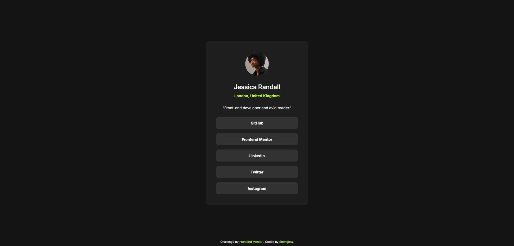

# Frontend Mentor - Social links profile solution

This is a solution to the [Social links profile challenge on Frontend Mentor](https://www.frontendmentor.io/challenges/social-links-profile-UG32l9m6dQ). Frontend Mentor challenges help you improve your coding skills by building realistic projects.

## Table of contents

- [Overview](#overview)
  - [The challenge](#the-challenge)
  - [Screenshot](#screenshot)
  - [Links](#links)
- [My process](#my-process)
  - [Built with](#built-with)
  - [What I learned](#what-i-learned)

## Overview

### The challenge

Users should be able to:

- See hover and focus states for all interactive elements on the page

### Screenshot



### Links

[Live Demo](https://shenglow.github.io/social-links-profile/)

## My process

### Built with

- Semantic HTML5 markup
- CSS custom properties

### What I learned

In this challenge, I learned about the `noopener` and `noreferrer` attributes, which are basic but often overlooked. These attributes are related to security and privacy and are usually used with `target="_blank"`.

The `noopener` attribute instructs the browser to navigate to the target page without granting access to the document that opened it.

The `noreferrer` attribute instructs the browser to omit the `Referer` header when navigating to the target page. This prevents the target page from knowing which website the user came from.

```html
<a href="#" target="_blank" rel="noopener noreferrer" class="button">
  GitHub
</a>
```
